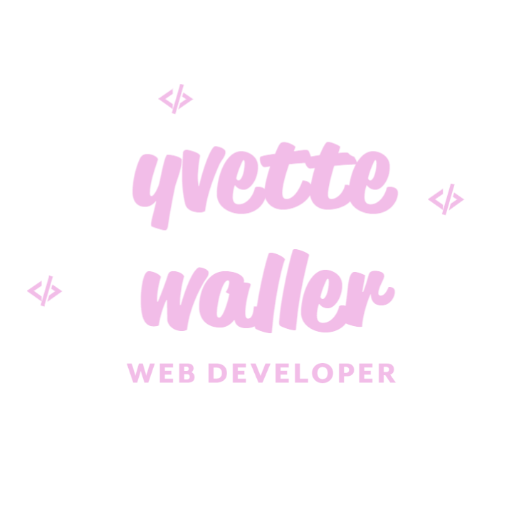

  <link rel="preconnect" href="https://fonts.googleapis.com">
<link rel="preconnect" href="https://fonts.gstatic.com" crossorigin>
<link href="https://fonts.googleapis.com/css2?family=Kaushan+Script&display=swap" rel="stylesheet">

    
<h1 style="font-family: Kaushan Script"> 🌟 Equusential Web Page Project 🌟 </h1>
 <!-- TABLE OF CONTENTS -->
## Table of Contents

* 🚀 [About the Project](#answers.project)
* 🛠️ [Installation](#installation)
* 😁 [Usage](#usage)
* ➕ [Contributing](#contributing)
* ⁉️ [Tests](#tests)
* 📑[License](#license)
* 😎[Contact](#contact)
* ❤️ [Creator & Acknowledgements](#acknowledgements)

  

<h2> 🚀 About ## Equusential Web Page project </h2>

  Business Page for my business. Providing Equine Myofunctional Therapy and Bit Fitting Services to the Gippsland Region.

  Screenshot of Project (Google Chrome): 
  

  Repo: https://github.com/vetty88/Equusential-Web-Page

Site: www.equusential.com.au

<h2> 🛠️ Installation </h2>
**To get a local copy up and running follow these simple steps.**

Edited and Created using VS code Tested in Google Chrome
Hosted with Custom Domain by adjusting GitHub Pages and custom domain routing settings

<h3> Prerequisites </h3>

Installation-
  Clone the repo
    git clone https://github.com/vetty88/Equusential Web Page.git

<h2> 😁 Usage </h2>

This project can be used fora Small Business Web Page. 

<h2> ➕ Contributing </h2>

Contributions are what make the open source community such an amazing place to be learn, inspire, and create. Regarding this project I respectfully make the following requests regarding contributions:

You are welcome to fork this repo if it is helpful!
  
Fork the Project
  Create your Feature Branch 
    (git checkout -b feature/AmazingFeature)
  Commit your Changes 
    (git commit -m 'Add some AmazingFeature')
  Push to the Branch 
    (git push origin feature/AmazingFeature)
  Open a Pull Request

<h2> ⁉️ Tests </h2>
Tested in VS Code and Google Chrome
 
<h2> 📑 License <h2>

<h2> 😎 Contact </h2>

Your Name - vetty88@gmail.com

Project Link: https://github.com/vetty88/Equusential Web Page

<h2> ❤️ Creator and Acknowledgements </h2>

Github User: vetty88

Yvette Waller 2021
Credits 
** 

